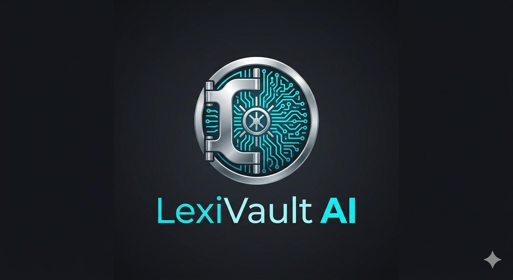

# 🛡️ LexiVault AI: Intelligent Document Vault & Automation

<p align="center">

</p>

**LexiVault AI** (evolución de DIVA-RAG) es un ecosistema de gestión documental de grado empresarial. No es solo una "caja fuerte" digital; es un sistema de inteligencia que comprende, clasifica y extrae datos de tus documentos mediante **Docling** para el análisis de maquetación estructural y **LangGraph** para orquestar flujos de trabajo inteligentes.

---

## 🎯 Objetivos del Proyecto

* **Comprensión Estructural Profunda:** Superar el OCR plano mediante **Docling**, permitiendo que la IA comprenda tablas, jerarquías y formatos complejos como si fuera un humano.
* **Automatización de Trámites (Camino Dual):** Arquitectura basada en agentes capaz de discernir entre una consulta informativa (**Chatbot**) y una tarea de extracción de datos validada (**Trámites**).
* **Privacidad Total (Sovereign AI):** Procesamiento local mediante **Ollama (Qwen 3.5)**, garantizando que los datos sensibles jamás salgan de tu infraestructura.
* **Bóveda de Conocimiento Zero:** Cifrado **Fernet** de grado militar en MinIO con gestión de secretos mediante **HashiCorp Vault**.

---

## 🏗️ Arquitectura del Sistema

LexiVault AI utiliza microservicios orquestados por Docker Compose, optimizados para el procesamiento asíncrono y la toma de decisiones autónoma.

| Componente | Tecnología | Función Principal |
| --- | --- | --- |
| **API Gateway** | **FastAPI** | Punto de entrada de alto rendimiento con enrutamiento inteligente. |
| **Parser Motor** | **Docling** | Convierte documentos complejos a **Markdown Estructural** preservando tablas y diseño. |
| **Orquestador** | **LangGraph** | Gestiona los estados del proceso, permitiendo flujos cíclicos y validaciones multi-agente. |
| **Cerebro (LLM)** | **Ollama** | Motor de razonamiento local (**Qwen 3.5**) para generación y extracción. |
| **Memoria Vectorial** | **PostgreSQL + pgvector** | Almacena metadatos y embeddings para búsqueda semántica. |
| **Bóveda Física** | **MinIO** | Almacenamiento de objetos S3 para binarios cifrados con versionado. |
| **Bus & Cache** | **Valkey** | Broker de mensajería para Celery y persistencia de estados de LangGraph. |

---

## 🔐 Seguridad y Confidencialidad

* **Cifrado en Reposo:** Documentos cifrados con **Fernet** (AES-128 en modo CBC) antes de ser almacenados en MinIO.
* **Escaneo de Amenazas:** Capa de escaneo de seguridad previa a la ingesta de archivos.
* **Gestión de Secretos (HashiCorp Vault):** Integración para el manejo dinámico de claves de cifrado y tokens JWT, eliminando secretos en texto plano.
* **Firma Digital (Roadmap):** Implementación de firmas electrónicas para garantizar integridad y no repudio.

---

## 📄 Formatos y Análisis de Maquetación Integral

El sistema utiliza modelos de visión artificial para transformar archivos en **Markdown Semántico**, permitiendo que la IA entienda el contexto visual:

* **Documentos PDF e Imágenes (.pdf, .png, .jpg):** Detección de tablas complejas, encabezados y OCR estructural.
* **Suite de Office (.docx, .xlsx, .pptx):** Conversión de hojas de cálculo a tablas Markdown reales y preservación de jerarquías de Word.
* **E-books (.epub, .mobi, .azw3):** Normalización de capítulos y limpieza de metadatos.
* **Estructurados (.json, .html, .md):** Parseo directo conservando la integridad técnica.

---

## 🔄 El Pipeline de Inteligencia

1. **Ingesta:** El archivo se recibe, se cifra y se guarda en MinIO.
2. **Procesamiento:** Celery activa **Docling** para generar la estructura Markdown.
3. **Razonamiento (LangGraph):** El router analiza la intención del usuario:
* **Ruta Chat:** Realiza búsqueda semántica en `pgvector` y responde dudas.
* **Ruta Extracción:** Mapea el texto a un esquema **Pydantic** para llenar formularios automáticamente.


---

## 🛠️ Instalación Rápida

1. **Clonar:**
```bash
git clone https://github.com/tu_usuario/lexivault-ai.git
cd lexivault-ai

```


2. **Iniciar Docker:**
```bash
docker compose up --build -d

```


3. **Descargar IA Local:**
```bash
docker exec -it lexivault-ai-brain ollama run qwen2.5:7b
docker exec -it lexivault-ai-brain ollama pull nomic-embed-text

```


---

## 🛣️ Próximos Pasos (Roadmap)

* [ ] **Integración Total con HashiCorp Vault.**
* [ ] **Módulo de Firma Digital.**
* [ ] **Human-in-the-loop:** Interfaz de validación manual para formularios extraídos.
